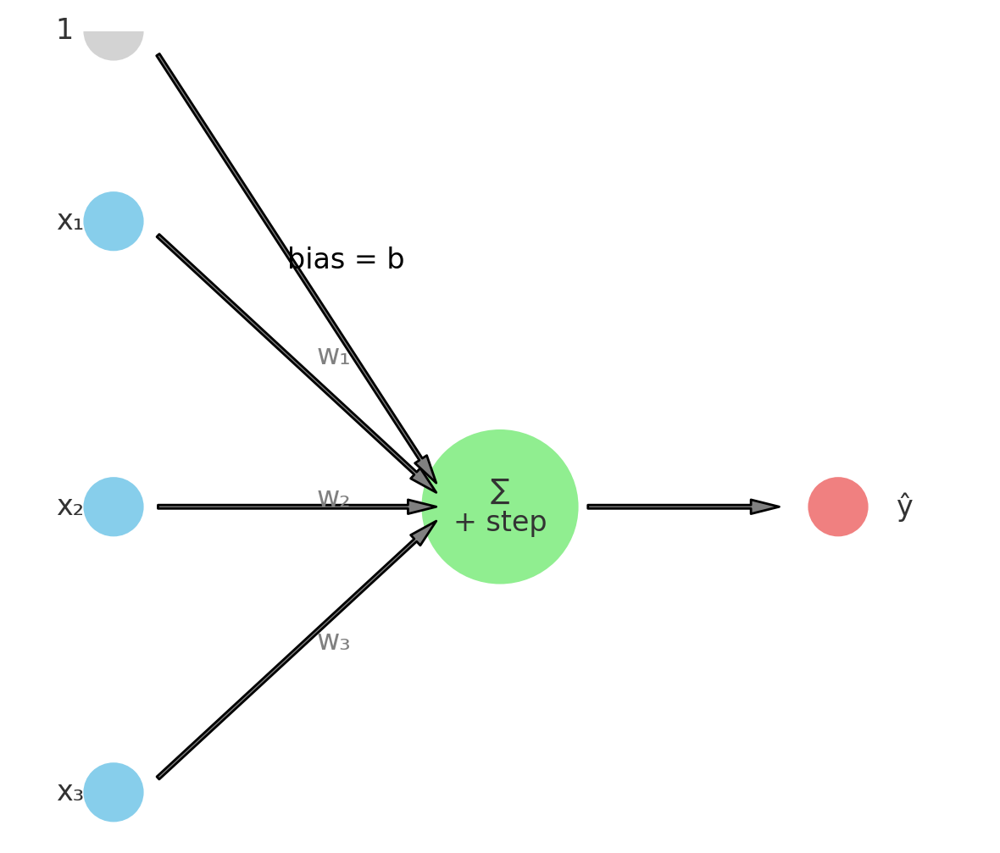
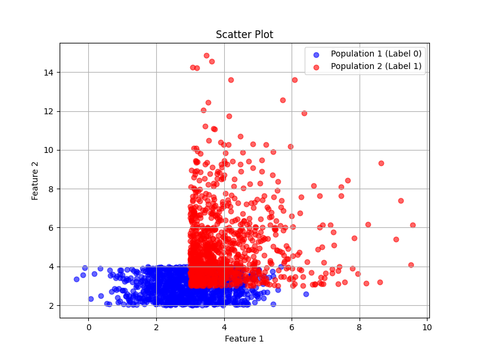
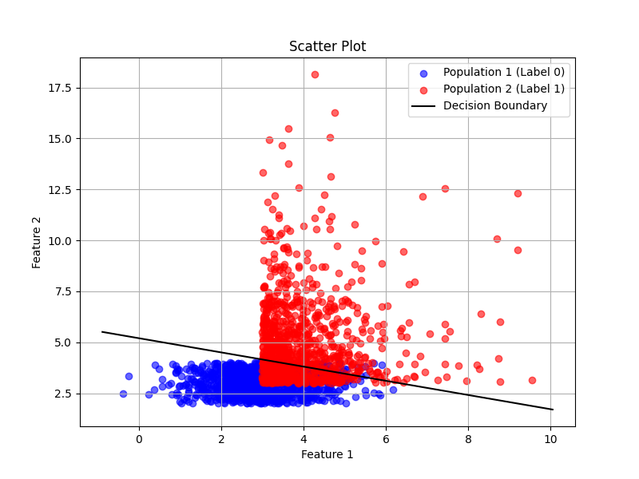

# 🧠 The Perceptron

The perceptron is one of the earliest and most fundamental building blocks of modern machine learning algorithms. It was introduced in 1958 by Frank Rosenblatt and was inspired by how neurons fire in the brain. It was applied by Rosenblatt in a visual pattern recognition task where it learned to recognize simple black and white shapes (e.g. squares or triangles) within a 20x20 grid of light-sensitive cells (400 pixesl). 

---

## The algorithm

The Perceptron is a simple supervised learning algorithm for binary classification tasks. It attempts to find a linear decision boundary that separates two classes by learning a set of parameters (denoted by weights) using training data with pre-assigned class labels - hence supervised learning. The input to the Perceptronis an n-dimensional vector: 

x = [x₁, x₂, ..., xₙ]

where each input is connected to the Perceptron via a weight. The vector of weights is thus also n-dimensional: 

w = [w₁, w₂, ..., wₙ]

with an additional weight, called the bias, not being linked to any inputs. An ai-generated example for a 3-dimensional case is shown below: 

Next, a weighted sum is computed:

s = w · x + b

which is passed through an activation function to arrive at a prediction. A commonly used activation function is the step function: 

ŷ = 1 if s > 0 else 0

which assigns label 0 (class 1) if s is negative, else it assigns label 1 (class 2). 

Learning in the Perceptron involves iteratively updating the weights based on the error. Specifically, the error is computed as ε = y - ŷ, and the are adjusted using:

wᵢ ← wᵢ + η × ε × xᵢ
b ← b + η × ε

where b is the bias and η is the learning rate. 

---

## 🐍 Python implementation

Classification Problem: We generate two classes of data. Class 1 is represented by 2-dimensional features, randomly sampled from a normal and a uniform distribution. Class 2 is represented by 2-dimensional features, randomly sampled from an exponential and chi-squared distribution. Both classes are arbitrarily offset by a value of 3. Training data comprises 1000 samples from each class. Note that for this toy example, classes are not perfectly linearly seperable. The training data is illustrated in the figure below. 

In the code "Perceptron.py", a Perceptron object is initialized within the __main__ function. The Perceptron class contains all functionality for training and prediction, and is initialized using: 

<pre>
P = Perceptron(input_size=2, learning_rate=0.0001, epochs=500)
</pre>

For  this example, the Perceptron was initialized for 2-dimensional input vector, a learning rate of η = 0.0001 andnusing 500 training iterations. The number of training iterations, denoted by epochs, specifies how many times the procedure loops through the full dataset (clarified below). These values are initialized within the __init__ function of the Perceptron class. Note that the weights are initially set to zero. 

After initializing the Perceptron object, training is initialized using P.train(D, L) where D is the previously defined dataset and L the associated labels. During the training, the Perceptron loops through all 2000 samples 500 times. For each sample, an error is computed, and the weights are adjusted accordingly:

<pre>
self.weights[0] += learning_rate * error       # Bias update
self.weights[1:] += learning_rate * error * x  # Feature weights update
</pre>

After training is completed, test accuracy is evaluated by counting the ratio of succesfully classified data samples: 

<pre>
accuracy = correct / len(D) * 100
</pre>

We can now also visualize the optimized decision boundary. In 2D, the perceptron this is computed as: 

<pre>
x₂ = -(w₀ + w₁·x₁) / w₂
</pre>

where x₁ and x₂ are the two dimensions of the input space. This equation defines a straight line with data points lieing above the line classified as 1 and those below the line as 0. 

---

## ❄️🤖 Perceptron limitations and the first AI winter
A first limitation for the Perceptron is its use of a  linear decision boundary. As shwon in the toy example above, a linear decision boundary is unable to perfectly seperate the two overlapping classes. The Perceptron also uses a step activation function, which is non-differentiable and limits its use in more advanced gradient-based optimization methods. The model is inherently shallow (a single-layer network) and cannot learn complex patterns. Finally, it is sensitive to the choice of learning rate and initial weights, which may affect convergence.

These limitations were highlighted by Minsky and Papert (1969), contributing to a temporary decline in neural network research — sometimes referred to as the first "AI Winter."

---

## 📚 References

Rosenblatt, F. (1958). The perceptron: A probabilistic model for information storage and organization in the brain. *Psychological Review, 65*(6), 386–408. https://doi.org/10.1037/h0042519

Minsky, M., & Papert, S. (1969). Perceptrons: An Introduction to Computational Geometry. Cambridge, MA: MIT Press.
